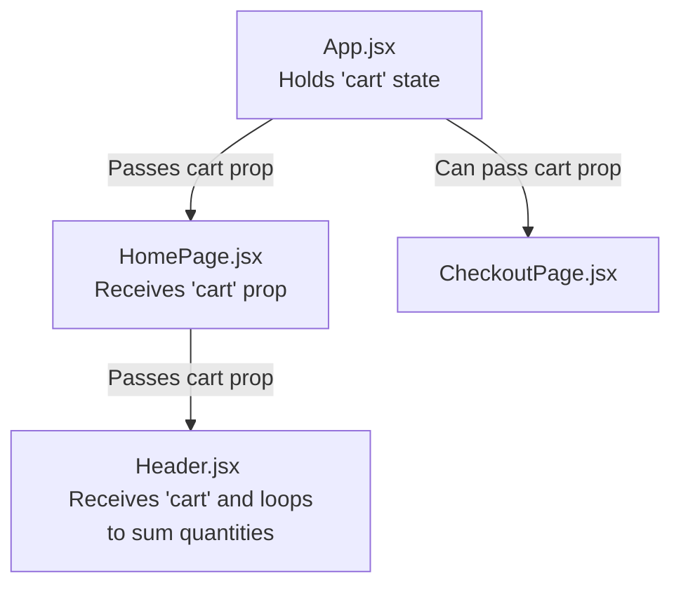

# E-Commerce Project: Technology & Architecture Documentation

Welcome to the central technology and architecture documentation for the E-Commerce Project! This document lists, explains, and details every major library, utility, hook, and technology used in this application so far. 

As we add new features and libraries, this documentation will be updated to serve as your ultimate developer reference.

---

## Table of Contents
1. [React Core & Hooks](#1-react-core--hooks)
   - [useState](#usestate)
   - [useEffect](#useeffect)
2. [React Router Navigation](#2-react-router-navigation)
   - [BrowserRouter](#browserrouter)
   - [Routes & Route](#routes--route)
   - [Link](#link)
3. [Data Fetching & APIs](#3-data-fetching--apis)
   - [Axios](#axios)
4. [React DOM Mounting & Dev Tools](#4-react-dom-mounting--dev-tools)
   - [createRoot](#createroot)
   - [StrictMode](#strictmode)
5. [State Lifting & Props Flow](#5-state-lifting--props-flow)
6. [Direct DOM Access & useRef](#6-direct-dom-access--useref)

---

## 1. React Core & Hooks

### useState
`useState` is a React Hook that lets you add **state** variables to functional components. State is memory for a component—it holds data that can change over time (like a list of products, cart quantity, or user input). When state changes, React immediately re-renders the component to display the updated data.

* **Import Syntax:**
  ```javascript
  import { useState } from 'react';
  ```
* **How It Works (Step-by-Step):**
  1. **Declaration:** You declare it inside your component: `const [state, setState] = useState(initialValue);`
  2. **Initial Value:** The argument passed to `useState()` is the starting value (e.g., `[]` for an empty array, `0` for numbers, `""` for strings).
  3. **The State Variable (`state`):** The first element in the array is the current value of the state. You use it in your HTML/JSX to display data.
  4. **The Setter Function (`setState`):** The second element is a function used to update the state. You *never* modify state directly (e.g., `products = response.data` is bad). Instead, you call `setProducts(response.data)`. This tells React: *"Hey! The data changed, please re-render this page now!"*
* **Real-World Example (`src/pages/HomePage.jsx`):**
  ```javascript
  // 1. Declare state with an empty array initial value
  const [products, setProducts] = useState([]);

  // 2. Loop through products and dynamically generate HTML
  return (
    <div className="products-grid">
      {products.map((product) => (
        <div key={product.id} className="product-container">
          <div className="product-name">{product.name}</div>
          <div className="product-price">${(product.priceCents / 100).toFixed(2)}</div>
        </div>
      ))}
    </div>
  );
  ```

---

### useEffect
`useEffect` is a React Hook that lets you synchronize a component with an external system (such as fetching data from a database, setting up timers, or manually modifying the DOM). It handles **side effects** that shouldn't block the main rendering flow.

* **Import Syntax:**
  ```javascript
  import { useEffect } from 'react';
  ```
* **How It Works (Step-by-Step):**
  1. **The Effect Callback:** You pass a function containing your side effect code (like a fetch request) as the first argument.
  2. **The Dependency Array:** You pass an array of variables as the second argument: `useEffect(() => { ... }, [dependencies])`.
     - **If Empty `[]`:** The effect runs **exactly once** after the component is first mounted (loaded onto the screen). This is perfect for fetching initial page data!
     - **If omitted entirely:** The effect runs after *every single render* (rarely what you want).
     - **With values `[count]`:** The effect runs when the page loads, and then runs again *only* if `count` changes.
* **Real-World Example (`src/pages/HomePage.jsx`):**
  ```javascript
  // Fetch products from backend once, right when the component loads
  useEffect(() => {
    axios.get('http://localhost:3000/api/products')
      .then((response) => {
        // Update state with server data, triggering a re-render
        setProducts(response.data);
      });
  }, []); // Empty array ensures this only runs ONCE on page load
  ```

---

## 2. React Router Navigation

React Router enables **Client-Side Routing**, which allows users to navigate between different pages (Home, Checkout, Orders, etc.) instantly without the web browser having to download a whole new HTML page from the server.

### BrowserRouter
`BrowserRouter` is the parent routing container. It uses the standard HTML5 History API under the hood to keep your application's UI in sync with the URL in the browser address bar.

* **Import Syntax:**
  ```javascript
  import { BrowserRouter } from 'react-router';
  ```
* **Real-World Example (`src/main.jsx`):**
  It wraps your entire `<App />` component at the root level so all components inside `<App />` can use routing features:
  ```javascript
  createRoot(document.getElementById('root')).render(
    <StrictMode>
      <BrowserRouter>
        <App />
      </BrowserRouter>
    </StrictMode>
  );
  ```

---

### Routes & Route
* **`Routes`**: Acts as a container component that evaluates all child `Route` components and decides which page to render based on the current URL path.
* **`Route`**: Maps a specific URL path to a React component.

* **Import Syntax:**
  ```javascript
  import { Routes, Route } from 'react-router';
  ```
* **Real-World Example (`src/App.jsx`):**
  ```javascript
  function App() {
    return (
      <Routes>
        {/* Render HomePage when path is "/" */}
        <Route index element={<HomePage />} />
        
        {/* Render CheckoutPage when path is "/checkout" */}
        <Route path="checkout" element={<CheckoutPage />} />
        
        {/* Render OrdersPage when path is "/orders" */}
        <Route path="orders" element={<OrdersPage />} />
        
        {/* Wildcard "*" renders 404 page if path doesn't match any above */}
        <Route path="*" element={<PageNotFound />} />
      </Routes>
    );
  }
  ```

---

### Link
`Link` is an interactive component that replaces standard HTML `<a>` tags for navigation. When a user clicks a regular `<a href="/orders">` tag, the browser is forced to reload the entire web page, clearing all React state. `<Link to="/orders">` intercepts the click, instantly changes the browser's URL, and renders the new page component without reloading.

* **Import Syntax:**
  ```javascript
  import { Link } from 'react-router';
  ```
* **Real-World Example (`src/components/Header.jsx`):**
  ```javascript
  // Instantly navigate to "/orders" without triggering a page reload
  <Link className="orders-link header-link" to="/orders">
    <span className="orders-text">Orders</span>
  </Link>
  ```

---

## 3. Data Fetching & APIs

### Axios
`Axios` is a premium, lightweight, promise-based HTTP client for the browser and Node.js. It simplifies communicating with your backend API to retrieve or send data.

* **Import Syntax:**
  ```javascript
  import axios from 'axios';
  ```
* **Why We Use It:**
  - Automatically parses JSON responses so you don't need to do `response.json()`.
  - Excellent security defaults and request/response interceptors.
  - Highly robust error handling compared to the native browser `fetch` API.
* **Real-World Example (`src/pages/HomePage.jsx`):**
  ```javascript
  axios.get('http://localhost:3000/api/products')
    .then((response) => {
      // response.data holds the actual array parsed automatically
      console.log(response.data);
    })
    .catch((error) => {
      console.error("Failed to fetch products:", error);
    });
  ```

---

## 4. React DOM Mounting & Dev Tools

### createRoot
`createRoot` is a React DOM entry-point method that creates a React Root container inside a specific HTML element (usually `<div id="root"></div>` in your `index.html`). This is where the entire React virtual DOM connects to your real webpage.

* **Import Syntax:**
  ```javascript
  import { createRoot } from 'react-dom/client';
  ```
* **Real-World Example (`src/main.jsx`):**
  ```javascript
  createRoot(document.getElementById('root')).render(
    <App />
  );
  ```

---

### StrictMode
`StrictMode` is a development helper component provided by React. It does not render any visible user interface. Instead, it activates extra checks and warnings for your components in development mode to help you identify potential bugs, obsolete lifecycle methods, memory leaks, or bad practices early.

* **Import Syntax:**
  ```javascript
  import { StrictMode } from 'react';
  ```
* **Why We Use It:**
  - Intentionally double-invokes certain lifecycle hooks (like `useEffect`) in development to make sure your components don't have side-effect bugs or memory leaks when mounted multiple times.
  - Generates console warnings if you are using deprecated features or APIs.
* **Real-World Example (`src/main.jsx`):**
  ```javascript
  <StrictMode>
    <App />
  </StrictMode>
  ```

---

## 5. State Lifting & Props Flow

In React, data flows in a single direction: **downward** (from parent to child components) via **Props** (short for properties). 

### What is State Lifting?
Sometimes, multiple sibling components (like your `Header` and the `CheckoutPage`) need to share the same data (like the shopping cart). In React, sibling components cannot talk directly to each other. 
To share the data, we **"lift"** the state up to their closest common parent component (in this case, `App.jsx`). The parent component holds the shared state and passes it down to its children via props.

### Real-World Example (Data Flow in this Project)



#### 1. The Source: `src/App.jsx`
The state is initialized at the top level and passed down through the Route component:
```javascript
function App() {
  const [cart, setCart] = useState([]);

  // Fetching cart items inside App
  useEffect(() => {
    axios.get("/api/cart-items").then((response) => {
      setCart(response.data);
    });
  }, []);

  return (
    <Routes>
      {/* We pass the cart state variable down to the HomePage element */}
      <Route index element={<HomePage cart={cart} />} />
      {/* Other routes */}
    </Routes>
  );
}
```

#### 2. The Midpoint: `src/pages/HomePage.jsx`
`HomePage` receives the `cart` prop in its function arguments (destructured) and forwards it directly to the `<Header>` component:
```javascript
// HomePage receives 'cart' as a prop
function HomePage({ cart }) {
  return (
    <>
      {/* HomePage passes 'cart' down to the Header component */}
      <Header cart={cart} />
      <div className="home-page">
        {/* ... products list ... */}
      </div>
    </>
  );
}
```

#### 3. The Destination: `src/components/Header.jsx`
The `Header` component receives the `cart` prop and uses it to calculate and display the total cart quantity dynamically:
```javascript
// Header receives the 'cart' prop
export function Header({ cart }) {
  let totalQuantity = 0;

  // Loops through the array to sum all item quantities
  cart.forEach((cartItem) => {
    totalQuantity += cartItem.quantity;
  });

  return (
    </div>
  );
}
```

---

## 6. Direct DOM Access & useRef

In modern React, your interface is **declarative**. This means you describe *what* the HTML should look like based on your *state* (data). You almost never need to manually select, edit, or delete HTML elements like you did in Vanilla JavaScript (e.g., using `document.getElementById` or `document.querySelector`).

As long as you fetch the data you need from your API, you can simply loop through it and output the elements dynamically. React handles all the creation, rendering, and removal under the hood.

### When do we actually need to select a DOM element?
Sometimes, you need to perform actions that cannot be done purely with HTML declarations:
* **Focusing an input field** (e.g., placing the cursor inside a search bar automatically).
* **Triggering a CSS transition/animation** manually.
* **Playing or pausing a HTML5 `<video>` or `<audio>` player**.
* **Measuring the exact pixel height or width** of an element.

In these rare cases, React provides the **`useRef`** hook to safely reference real DOM elements.

### How it Works (Declarative vs. Imperative)

* **Import Syntax:**
  ```javascript
  import { useRef } from 'react';
  ```

* **Step-by-Step Implementation:**
  1. **Create the Ref:** Initialize a reference variable using `useRef(null)` inside your component.
  2. **Attach the Ref:** Assign it to a JSX element using the special `ref` attribute.
  3. **Access the DOM Element:** React automatically links the element to your reference. You can access the real, raw DOM element using `.current`.

* **Code Example (Focusing an Input on Button Click):**
  ```javascript
  import { useRef } from 'react';

  function SearchBar() {
    // 1. Create a reference to hold the input element
    const inputRef = useRef(null);

    const handleSearchClick = () => {
      // 3. Access the raw DOM input element and call .focus()
      inputRef.current.focus();
    };

    return (
      <div className="search-container">
        {/* 2. Attach the ref to the physical input element */}
        <input ref={inputRef} type="text" placeholder="Search..." />
        
        <button onClick={handleSearchClick}>Focus Search</button>
      </div>
    );
  }
  ```

### Why we do NOT use `document.querySelector` in React:
1. **The Virtual DOM:** React works by maintaining a virtual copy of your webpage. Using `document.querySelector` bypasses React's virtual model, which can lead to visual bugs, states getting out of sync, or the page crashing when elements are dynamically added/removed.
2. **Component Reusability:** If you render a component twice on the same page, `document.querySelector('#my-button')` will always select the *first* button on the page, confusing your app. A `ref` is local to each specific instance of the component, ensuring it always targets the correct element.
