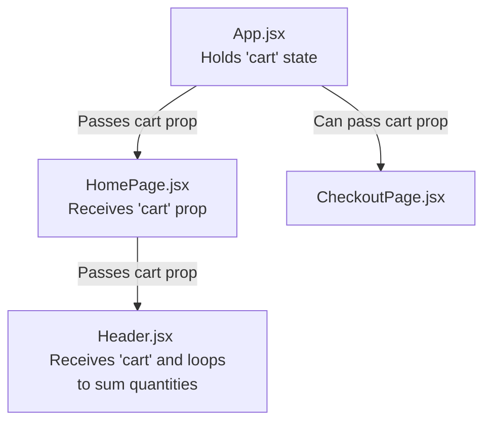

# E-Commerce Project: Technology & Architecture Documentation

Welcome to the central technology and architecture documentation for the E-Commerce Project! This document lists, explains, and details every major library, utility, hook, and technology used in this application so far. 

As we add new features and libraries, this documentation will be updated to serve as your ultimate developer reference.

---

## Table of Contents
1. [React Core & Hooks](#1-react-core--hooks)
   - [useState](#usestate)
   - [Controlled Inputs](#controlled-inputs-with-usestate)
   - [useEffect](#useeffect)
2. [React Router Navigation](#2-react-router-navigation)
   - [BrowserRouter](#browserrouter)
   - [Routes & Route](#routes--route)
   - [Link](#link)
3. [Data Fetching & APIs](#3-data-fetching--apis)
   - [Axios](#axios)
   - [Promise .then vs. async/await](#handling-asynchronous-operations-promise-then-vs-asyncawait)
   - [Axios vs. async/await](#axios-vs-asyncawait-understanding-the-core-difference)
4. [React DOM Mounting & Dev Tools](#4-react-dom-mounting--dev-tools)
   - [createRoot](#createroot)
   - [StrictMode](#strictmode)
5. [State Lifting & Props Flow](#5-state-lifting--props-flow)
   - [Rendering Lists: Props & Keys](#rendering-lists-component-props-and-keys)
6. [Direct DOM Access & useRef](#6-direct-dom-access--useref)

---

## 1. React Core & Hooks

### useState
`useState` is a React Hook that lets you add **state** variables to functional components. State is memory for a component—it holds data that can change over time (like a list of products, cart quantity, or user input). When state changes, React immediately re-renders the component to display the updated data.

* **Import Syntax:**
  ```javascript
  import { useState } from 'react';
  ```
* **How It Works (Step-by-Step):**
  1. **Declaration:** You declare it inside your component: `const [state, setState] = useState(initialValue);`
  2. **Initial Value:** The argument passed to `useState()` is the starting value (e.g., `[]` for an empty array, `0` for numbers, `""` for strings).
  3. **The State Variable (`state`):** The first element in the array is the current value of the state. You use it in your HTML/JSX to display data.
  4. **The Setter Function (`setState`):** The second element is a function used to update the state. You *never* modify state directly (e.g., `products = response.data` is bad). Instead, you call `setProducts(response.data)`. This tells React: *"Hey! The data changed, please re-render this page now!"*
* **Real-World Example (`src/pages/HomePage.jsx`):**
  ```javascript
  // 1. Declare state with an empty array initial value
  const [products, setProducts] = useState([]);

  // 2. Loop through products and dynamically generate HTML
  return (
    <div className="products-grid">
      {products.map((product) => (
        <div key={product.id} className="product-container">
          <div className="product-name">{product.name}</div>
          <div className="product-price">${(product.priceCents / 100).toFixed(2)}</div>
        </div>
      ))}
    </div>
  );
  ```

#### Controlled Inputs with useState

In traditional HTML/JavaScript, when a user types into a text input, the web browser's DOM manages the input's value internally. If you want to access that value, you must query the DOM (e.g., using `document.getElementById('search').value`).

In React, we prefer **Controlled Inputs**. A controlled input is a form element whose value is entirely driven by React **state** rather than the browser's DOM. React becomes the "single source of truth" for the input field.

##### How It Works (The 2-Way Binding):
To create a controlled input, you must link two properties:
1. **`value` Prop:** You bind the input's `value` attribute directly to your React state variable.
2. **`onChange` Event Handler:** You listen for changes and update your state variable using the setter function (`e.target.value` gets the current text).

##### Real-World Code Example:
```javascript
import { useState } from 'react';

function SearchBox() {
  const [query, setQuery] = useState(""); // Initialize state

  return (
    <div className="search-wrapper">
      <input 
        type="text" 
        value={query} // 1. Drive value from state
        onChange={(e) => setQuery(e.target.value)} // 2. Update state when typing
        placeholder="Search products..." 
      />
      <p>You are searching for: {query}</p>
    </div>
  );
}
```

##### Why Use Controlled Inputs?
* **Instant Validation:** You can validate user input as they type (e.g., block numeric characters or format a credit card number on the fly).
* **Dynamic UI Behavior:** You can instantly filter a list, enable/disable buttons, or display input warning labels in real-time as the user types because every keystroke triggers a state update and re-render.
* **Easy Resets:** Clearing or pre-filling the input field is as simple as calling `setQuery("")` or setting an initial state, which automatically keeps the input UI perfectly in sync.

---

### useEffect
`useEffect` is a React Hook that lets you synchronize a component with an external system (such as fetching data from a database, setting up timers, or manually modifying the DOM). It handles **side effects** that shouldn't block the main rendering flow.

* **Import Syntax:**
  ```javascript
  import { useEffect } from 'react';
  ```
* **How It Works (Step-by-Step):**
  1. **The Effect Callback:** You pass a function containing your side effect code (like a fetch request) as the first argument.
  2. **The Dependency Array:** You pass an array of variables as the second argument: `useEffect(() => { ... }, [dependencies])`.
     - **If Empty `[]`:** The effect runs **exactly once** after the component is first mounted (loaded onto the screen). This is perfect for fetching initial page data!
     - **If omitted entirely:** The effect runs after *every single render* (rarely what you want).
     - **With values `[count]`:** The effect runs when the page loads, and then runs again *only* if `count` changes.
* **Real-World Example (`src/pages/HomePage.jsx`):**
  ```javascript
  // Fetch products from backend once, right when the component loads
  useEffect(() => {
    axios.get('http://localhost:3000/api/products')
      .then((response) => {
        // Update state with server data, triggering a re-render
        setProducts(response.data);
      });
  }, []); // Empty array ensures this only runs ONCE on page load
  ```

---

## 2. React Router Navigation

React Router enables **Client-Side Routing**, which allows users to navigate between different pages (Home, Checkout, Orders, etc.) instantly without the web browser having to download a whole new HTML page from the server.

### BrowserRouter
`BrowserRouter` is the parent routing container. It uses the standard HTML5 History API under the hood to keep your application's UI in sync with the URL in the browser address bar.

* **Import Syntax:**
  ```javascript
  import { BrowserRouter } from 'react-router';
  ```
* **Real-World Example (`src/main.jsx`):**
  It wraps your entire `<App />` component at the root level so all components inside `<App />` can use routing features:
  ```javascript
  createRoot(document.getElementById('root')).render(
    <StrictMode>
      <BrowserRouter>
        <App />
      </BrowserRouter>
    </StrictMode>
  );
  ```

---

### Routes & Route
* **`Routes`**: Acts as a container component that evaluates all child `Route` components and decides which page to render based on the current URL path.
* **`Route`**: Maps a specific URL path to a React component.

* **Import Syntax:**
  ```javascript
  import { Routes, Route } from 'react-router';
  ```
* **Real-World Example (`src/App.jsx`):**
  ```javascript
  function App() {
    return (
      <Routes>
        {/* Render HomePage when path is "/" */}
        <Route index element={<HomePage />} />
        
        {/* Render CheckoutPage when path is "/checkout" */}
        <Route path="checkout" element={<CheckoutPage />} />
        
        {/* Render OrdersPage when path is "/orders" */}
        <Route path="orders" element={<OrdersPage />} />
        
        {/* Wildcard "*" renders 404 page if path doesn't match any above */}
        <Route path="*" element={<PageNotFound />} />
      </Routes>
    );
  }
  ```

---

### Link
`Link` is an interactive component that replaces standard HTML `<a>` tags for navigation. When a user clicks a regular `<a href="/orders">` tag, the browser is forced to reload the entire web page, clearing all React state. `<Link to="/orders">` intercepts the click, instantly changes the browser's URL, and renders the new page component without reloading.

* **Import Syntax:**
  ```javascript
  import { Link } from 'react-router';
  ```
* **Real-World Example (`src/components/Header.jsx`):**
  ```javascript
  // Instantly navigate to "/orders" without triggering a page reload
  <Link className="orders-link header-link" to="/orders">
    <span className="orders-text">Orders</span>
  </Link>
  ```

---

## 3. Data Fetching & APIs

### Axios
`Axios` is a premium, lightweight, promise-based HTTP client for the browser and Node.js. It simplifies communicating with your backend API to retrieve or send data.

* **Import Syntax:**
  ```javascript
  import axios from 'axios';
  ```
* **Why We Use It:**
  - Automatically parses JSON responses so you don't need to do `response.json()`.
  - Excellent security defaults and request/response interceptors.
  - Highly robust error handling compared to the native browser `fetch` API.

---

### Handling Asynchronous Operations: Promise `.then` vs. `async/await`

Because fetching data from a server takes time, JavaScript handles these requests **asynchronously**—meaning the browser doesn't freeze or block the rest of the application while waiting for the response. There are two primary patterns used in our React applications to manage this: **Promise `.then()` chaining** and the **`async/await`** syntax.

---

#### 1. Promise `.then()` Chaining (Traditional Style)
Under the hood, `axios` requests return a **Promise** object. A Promise represents an operation that hasn't completed yet but is expected to in the future. To handle the successful completion of a Promise, we chain a `.then()` block. To handle failures, we append a `.catch()` block.

* **How It Works (Step-by-Step):**
  1. **Initiate Request:** `axios.get(url)` sends the request and returns a Promise.
  2. **Success Chaining (`.then`):** When the server successfully returns the data, the callback function inside `.then()` executes, receiving the `response` object.
  3. **Failure Capture (`.catch`):** If the network is down or the server throws an error (e.g., a `500 Internal Server Error`), the code skips `.then()` and runs the callback function inside `.catch()`.

* **Real-World Example (`src/pages/checkout/CheckoutPage.jsx`):**
  ```javascript
  useEffect(() => {
    // 1. Send the GET request
    axios.get("/api/payment-summary")
      .then((response) => {
        // 2. Executed when the request succeeds
        setPaymentSummary(response.data);
      })
      .catch((error) => {
        // 3. Executed if the request fails
        console.error("Error fetching payment summary:", error);
      });
  }, []);
  ```

---

#### 2. `async/await` Syntax (Modern Style)
Introduced in newer JavaScript standards (ES8), `async/await` is a syntactic wrapper built on top of Promises. It allows you to write asynchronous code that looks and behaves like synchronous (line-by-line) code. This significantly improves readability and simplifies error handling using standard `try/catch` blocks.

* **The Rules of `async/await`:**
  - **`async` keyword:** You must place the `async` keyword before a function declaration to turn it into an asynchronous function.
  - **`await` keyword:** You place the `await` keyword before any Promise-returning statement (like `axios.get`). The execution of the function pauses at that line until the Promise resolves, then assigns the result directly to the variable.
  - **`try/catch` blocks:** Since we don't have `.catch()`, we wrap our code in a `try {}` block, and handle any errors in a `catch (error) {}` block.

* **CRITICAL React Gotcha (Async in `useEffect`):**
  A React `useEffect` hook callback function **cannot** be declared directly as `async` (e.g., `useEffect(async () => { ... })` is illegal). This is because `useEffect` expects its callback to return either nothing or a cleanup function. An `async` function implicitly returns a Promise, which confuses React.
  
  **The Solution:** Declare a nested `async` function *inside* the effect callback, and then invoke it immediately.

* **Real-World Example (`src/pages/checkout/CheckoutPage.jsx`):**
  ```javascript
  useEffect(() => {
    // 1. Declare a nested async function
    const fetchPaymentSummary = async () => {
      try {
        // 2. Await the Axios promise directly
        const response = await axios.get("/api/payment-summary");
        
        // 3. Update state with response data
        setPaymentSummary(response.data);
      } catch (error) {
        // 4. Safely handle errors in the catch block
        console.error("Error fetching payment summary:", error);
      }
    };

    // 5. Invoke the nested async function immediately
    fetchPaymentSummary();
  }, []);
  ```

---

#### Comparison: `.then` vs `async/await`

| Feature | Promise `.then()` | `async/await` |
| :--- | :--- | :--- |
| **Readability** | Can lead to nested callback nesting ("callback hell") with multiple requests. | Looks like synchronous code, reading linearly from top to bottom. |
| **Error Handling** | Handled via `.catch()` chained to the end of the Promise. | Handled using standard JavaScript `try/catch` blocks. |
| **Variables Scope** | Variables resolved inside `.then()` are scoped within that callback. | Variables resolved using `await` are available in the entire function scope. |
| **Debugging** | Harder to place breakpoints or step through code line-by-line. | Easy to set breakpoints and step through asynchronously line-by-line. |

---

#### Axios vs. async/await: Understanding the Core Difference

A very common point of confusion when starting out with modern web development is understanding the difference—and relationship—between **Axios** and **async/await**. They are not competing technologies, but rather complementary partners that handle different aspects of asynchronous programming.

| Aspect | Axios | `async/await` |
| :--- | :--- | :--- |
| **What is it?** | An **HTTP Client Library** (third-party package). | A **JavaScript Language Syntax** (native feature). |
| **Primary Job** | Sending and receiving network requests (HTTP GET, POST, etc.) to/from a backend API server. | Managing and simplifying asynchronous control flow (Promises) in JavaScript code. |
| **Alternative to...** | The browser's native `fetch()` API or `XMLHttpRequest`. | Promise `.then()` and `.catch()` chains. |
| **How they interact** | An Axios request (like `axios.get('/api')`) returns a native JavaScript **Promise** object. | You place `await` before an Axios call to pause execution until that **Promise** resolves, extracting the result. |

##### Real-World Analogy: Ordering Food
* **Axios is the Delivery Service (e.g., DoorDash or UberEats).** It is the actual mechanism that travels to the restaurant (server), fetches the food (data), and brings it back to your door.
* **`async/await` is how you wait for the food.**
  * Using **`.then()`** is like sitting by the window, watching the street, and setting up a callback: *"When the driver arrives, then I will eat."*
  * Using **`async/await`** is like going about your day and simply pausing your current task when the doorbell rings: you `await` the delivery, receive it directly into your hands, and then resume your next line of work.

---

## 4. React DOM Mounting & Dev Tools

### createRoot
`createRoot` is a React DOM entry-point method that creates a React Root container inside a specific HTML element (usually `<div id="root"></div>` in your `index.html`). This is where the entire React virtual DOM connects to your real webpage.

* **Import Syntax:**
  ```javascript
  import { createRoot } from 'react-dom/client';
  ```
* **Real-World Example (`src/main.jsx`):**
  ```javascript
  createRoot(document.getElementById('root')).render(
    <App />
  );
  ```

---

### StrictMode
`StrictMode` is a development helper component provided by React. It does not render any visible user interface. Instead, it activates extra checks and warnings for your components in development mode to help you identify potential bugs, obsolete lifecycle methods, memory leaks, or bad practices early.

* **Import Syntax:**
  ```javascript
  import { StrictMode } from 'react';
  ```
* **Why We Use It:**
  - Intentionally double-invokes certain lifecycle hooks (like `useEffect`) in development to make sure your components don't have side-effect bugs or memory leaks when mounted multiple times.
  - Generates console warnings if you are using deprecated features or APIs.
* **Real-World Example (`src/main.jsx`):**
  ```javascript
  <StrictMode>
    <App />
  </StrictMode>
  ```

---

## 5. State Lifting & Props Flow

In React, data flows in a single direction: **downward** (from parent to child components) via **Props** (short for properties). 

### What is State Lifting?
Sometimes, multiple sibling components (like your `Header` and the `CheckoutPage`) need to share the same data (like the shopping cart). In React, sibling components cannot talk directly to each other. 
To share the data, we **"lift"** the state up to their closest common parent component (in this case, `App.jsx`). The parent component holds the shared state and passes it down to its children via props.

### Real-World Example (Data Flow in this Project)



#### 1. The Source: `src/App.jsx`
The state is initialized at the top level and passed down through the Route component:
```javascript
function App() {
  const [cart, setCart] = useState([]);

  // Fetching cart items inside App
  useEffect(() => {
    axios.get("/api/cart-items").then((response) => {
      setCart(response.data);
    });
  }, []);

  return (
    <Routes>
      {/* We pass the cart state variable down to the HomePage element */}
      <Route index element={<HomePage cart={cart} />} />
      {/* Other routes */}
    </Routes>
  );
}
```

#### 2. The Midpoint: `src/pages/HomePage.jsx`
`HomePage` receives the `cart` prop in its function arguments (destructured) and forwards it directly to the `<Header>` component:
```javascript
// HomePage receives 'cart' as a prop
function HomePage({ cart }) {
  return (
    <>
      {/* HomePage passes 'cart' down to the Header component */}
      <Header cart={cart} />
      <div className="home-page">
        {/* ... products list ... */}
      </div>
    </>
  );
}
```

#### 3. The Destination: `src/components/Header.jsx`
The `Header` component receives the `cart` prop and uses it to calculate and display the total cart quantity dynamically:
```javascript
// Header receives the 'cart' prop
export function Header({ cart }) {
  let totalQuantity = 0;

  // Loops through the array to sum all item quantities
  cart.forEach((cartItem) => {
    totalQuantity += cartItem.quantity;
  });

  return (
    </div>
  );
}

### Rendering Lists: Component Props and Keys

When refactoring a large block of HTML/JSX inside a loop into its own custom component (e.g., pulling a single product card out of a `.map()` loop in a `ProductsGrid` into a separate `Product` component), there are two core concepts to handle: **Props Passing** and **Unique Keys**.

#### 1. Why We Pass Props (e.g., `product={product}`)
When you create a component like `Product.jsx`, it is a **blueprint** or **template**. It defines *how* any given product should be rendered. 
* Writing `export function Product({ product, loadCart })` is like declaring a JavaScript function: `function renderProduct(product, loadCart)`.
* It defines the *parameter inputs* but doesn't actually contain the real data yet.
* When you loop through your products array inside `ProductsGrid.jsx` using `products.map((product) => ...)` and render `<Product product={product} />`, you are **invoking** the component with the specific product data for *that* iteration of the loop.
* If you didn't pass `product={product}` as a prop, the `<Product />` component would render as an empty shell because it wouldn't know which specific product's name, image, or price it is supposed to display.

#### 2. The proper name: "Rendering Components"
Using a component inside JSX (e.g., `<Product />`) is formally known as **rendering a component** or **instantiating a component** (not "file calling").

#### 3. Why We Pass the `key` Prop in the Loop
A common source of confusion is the `key` prop (e.g., `key={product.id}`).
* **Why React needs it:** When rendering a list of items dynamically, React needs a unique identifier for each item to track it in the virtual DOM. If items are added, removed, or reordered, React uses the `key` to know exactly which DOM elements to update rather than rebuilding the entire list.
* **Where the `key` must live:** The `key` must **always** be placed on the element returned *directly* inside the `.map()` loop. In this project:
  * **Correct:** `<Product key={product.id} ... />` inside `ProductsGrid.jsx`. React evaluates this key at the boundary of the loop.
  * **Redundant:** Putting `key={product.id}` inside the root `div` inside `Product.jsx` does nothing for list tracking, because React does not inspect the internals of `<Product>` when reconciling the top-level list elements.

---

## 6. Direct DOM Access & useRef

In modern React, your interface is **declarative**. This means you describe *what* the HTML should look like based on your *state* (data). You almost never need to manually select, edit, or delete HTML elements like you did in Vanilla JavaScript (e.g., using `document.getElementById` or `document.querySelector`).

As long as you fetch the data you need from your API, you can simply loop through it and output the elements dynamically. React handles all the creation, rendering, and removal under the hood.

### When do we actually need to select a DOM element?
Sometimes, you need to perform actions that cannot be done purely with HTML declarations:
* **Focusing an input field** (e.g., placing the cursor inside a search bar automatically).
* **Triggering a CSS transition/animation** manually.
* **Playing or pausing a HTML5 `<video>` or `<audio>` player**.
* **Measuring the exact pixel height or width** of an element.

In these rare cases, React provides the **`useRef`** hook to safely reference real DOM elements.

### How it Works (Declarative vs. Imperative)

* **Import Syntax:**
  ```javascript
  import { useRef } from 'react';
  ```

* **Step-by-Step Implementation:**
  1. **Create the Ref:** Initialize a reference variable using `useRef(null)` inside your component.
  2. **Attach the Ref:** Assign it to a JSX element using the special `ref` attribute.
  3. **Access the DOM Element:** React automatically links the element to your reference. You can access the real, raw DOM element using `.current`.

* **Code Example (Focusing an Input on Button Click):**
  ```javascript
  import { useRef } from 'react';

  function SearchBar() {
    // 1. Create a reference to hold the input element
    const inputRef = useRef(null);

    const handleSearchClick = () => {
      // 3. Access the raw DOM input element and call .focus()
      inputRef.current.focus();
    };

    return (
      <div className="search-container">
        {/* 2. Attach the ref to the physical input element */}
        <input ref={inputRef} type="text" placeholder="Search..." />
        
        <button onClick={handleSearchClick}>Focus Search</button>
      </div>
    );
  }
  ```

### Why we do NOT use `document.querySelector` in React:
1. **The Virtual DOM:** React works by maintaining a virtual copy of your webpage. Using `document.querySelector` bypasses React's virtual model, which can lead to visual bugs, states getting out of sync, or the page crashing when elements are dynamically added/removed.
2. **Component Reusability:** If you render a component twice on the same page, `document.querySelector('#my-button')` will always select the *first* button on the page, confusing your app. A `ref` is local to each specific instance of the component, ensuring it always targets the correct element.
